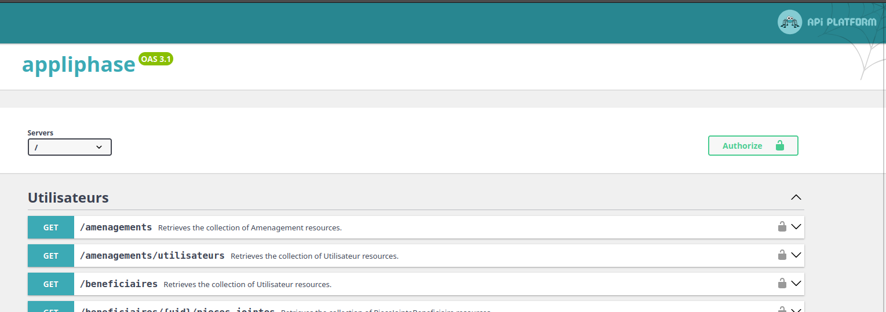

# Utilisation de l'API

Toutes les fonctionnalités de l'application sont disponibles via une API REST.  
Elle est utilisable / testable via une interface web swagger-ui, disponible à la racine de l'application.

## Authentification

Voir [la section dédiée](auth.md)

## Usage

Une fois authentifié depuis le même navigateur, vous disposez d'un cookie contenant le token adhoc, vous pouvez donc
interroger l'api avec les droits d'accès correspondants à votre compte.
Si vous disposez d'un token valide obtenu par ailleurs, vous pouvez également utiliser le bouton `Authorize` et y saisir
à la main le header Authorization : `Bearer montoken`.

Un bon point de départ pour avoir une vision de ce qu'il est possible de faire via l'api est de consulter les tests
fonctionnels behat (https://docs.behat.org/) disponibles [ici](../../backend/features).

## Endpoints particuliers

### Utilisateurs

La gestion des utilisateurs dans Oasis s'appuie sur l'annuaire LDAP en tant que référentiel des individus, elle ne
propose donc pas de création (`POST`) mais uniquement des modifications (`PATCH`) des attributs spécifiques à
l'application.

Cela peut amener à un fonctionnement en apparence contre-intuitif :

* on ne permet pas de récupération complète de la liste des utilisateurs (`GET /utilisateurs`) sans filtre, qui
  reviendrait à ramener l'ensemble de l'annuaire
* on permet une recherche textuelle dans l'annuaire via `GET /utilisateurs?term=marecherche`, qui va enrichir les
  résultats présentés avec les données spécifiques à Oasis (plus de détail
  dans [la section dédiée aux connecteurs](connecteurs.md)).
* l'accès direct à un utilisateur donné se fait via `/utilisateurs/{uid}`, et va répondre pour tous les utilisateurs
  connus dans l'annuaire, y compris s'ils ne sont pas présents dans la base Oasis. Partout où un utilisateur est
  attendu dans l'api, vous pouvez donc spécifier un utilisateur qui n'est pas encore déclaré.

### Téléversement de documents

Le téléversement de fichiers et le lien de ces fichiers avec les autres données se fait en deux étapes :

* un POST sur `/telechargements` permet de téléverser un fichier
* un GET sur `/telechargements/{id}` permet d'obtenir les metadonnées du fichier téléversé (identifiant, nom, type MIME,
  utilisateur propriétaire, url qui va retourner le contenu)
* lors de la création d'une ressource ayant un fichier lié (par ex. un entretien), l'identifiant du fichier doit être
  utilisé.
* Un utilisateur autorisé pourra consulter le fichier proprement dit en consultant l'url fournie par
  `/telechargements/{id}` (`/fichiers/{id}`).
* Il n'y a pas de suppression physique des fichiers via l'API. Un traitement asynchrone se charge périodiquement du
  nettoyage des fichiers non utilisés (voir [la section traitant du stockage des fichiers](pieces_justificatives.md))