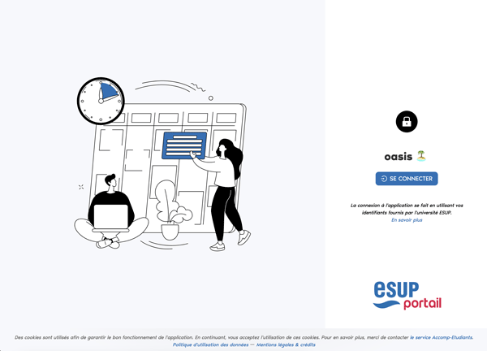

# Oasis - frontend

## Composants techniques

L'application est développée avec **React 18** (TypeScript). Elle utilise les packages complémentaires suivants :

- **React Redux** pour la gestion d'état.
- **React Router 6** pour la gestion des routes.
- **React Query 5** pour la gestion des requêtes asynchrones.
- **Ant Design 5** comme bibliothèque de composants UI.

**Node.js 22.11 (LTS - Long Term Support)** est utilisé avec le gestionnaire de paquets **Yarn**.

## Documentation

### [1. Configuration technique](configuration.md)
### [2. Configuration liée à l'environnement d'exécution](configuration-environnement.md)
### [3. Personnalisation UI](personnalisation-ui.md)
### [4. Constantes](constantes.md)
### [5. Déploiement](deploiement.md)
### [6. Developpement](developpement.md)
### [7. Accessibilité](accessibilite.md)

### [Toutes les variables](variables.md)