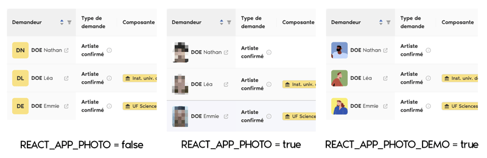

# Configuration de l'environnement d'exécution de l'application

Certaines variables de configuration sont spécifiques à chaque environnement d'exécution de l'application (
développement, staging, production). Par exemple, l'URL de l'API peut varier selon l'environnement déployé.

Pour éviter de reconstruire l'image pour chaque environnement, il est possible de définir des variables d'environnement
qui seront injectées dynamiquement dans l'application au moment de son exécution.

La gestion de ces variables d'environnement repose sur la
librairie [react-inject-env](https://github.com/codegowhere/react-inject-env/). Un fichier `env.js` servant à injecter
les valeurs est généré au lancement du conteneur.

> **Remarque :** Vous pouvez déplacer les variables d'environnement entre les fichiers `.env` et `env.js` en fonction
> des besoins et de la portée souhaitée de chaque variable.

> **Remarque :** Les variables injectées sont prioritaires sur celles définies dans le fichier `.env`.

> **Note :** Si l'application n'est pas déployée sur plusieurs environnements ou si l'image est reconstruite pour chaque 
> environnement, il est possible de définir les variables suivantes directement dans le fichier `.env`.

## Variables liées à l'environnement d'exécution

| **Variable**                | **Description**                                      | **Exemple**                                         | **Obligatoire** |
|-----------------------------|------------------------------------------------------|-----------------------------------------------------|-----------------|
| `REACT_APP_ENVIRONMENT`     | Environnement d'exécution de l'application           | production                                          | Oui             |
| `REACT_APP_API`             | URL de l'API de l'application (backend)              | https://api.esup-portail.org                        | Oui             |
| `REACT_APP_FRONTEND`        | URL de l'application (frontend)                      | https://oasis.esup-portail.org                      | Oui             |
| `REACT_APP_OAUTH_CLIENT_ID` | Identifiant du client OAuth                          | oasis                                               | Oui             |
| `REACT_APP_OAUTH_PROVIDER`  | URL du fournisseur OAuth                             | https://cas.esup-portail.org/cas/oauth2.0/authorize | Oui             |
| `REACT_APP_PHOTO`           | Afficher les photos des étudiants dans l'application | true                                                | Non             |
| `REACT_APP_PHOTO_DEMO`      | Remplacer les photos par un avatar                   | false                                               | Non             |

## Focus sur l'affichage des photos des étudiants

3 modes d'affichage sont disponibles :

L'affichage des photos des étudiants nécessite une configuration spécifique au niveau du backend. Par défaut, les photos
ne sont pas affichées, mais cette option peut être activée en ajustant les variables `REACT_APP_PHOTO` et
`REACT_APP_PHOTO_DEMO` :

- `REACT_APP_PHOTO` : active l'affichage des photos des étudiants.
- `REACT_APP_PHOTO_DEMO` : remplace les photos par des avatars, utile en développement ou en mode démonstration pour
  préserver la confidentialité.

### Spécificités liées aux environnements

| **Valeur de `REACT_APP_ENVIRONMENT`** | **Environnement**   | **Spécificités**                                                                                                                                                        |
|---------------------------------------|---------------------|-------------------------------------------------------------------------------------------------------------------------------------------------------------------------|
| `local`                               | Développement local | - Les photos des utilisateurs ne sont pas affichées. - Le fournisseur `AuthContext` expose le token de l'utilisateur. - Affichage d'un ruban "DEV" sur le logo. |
| `production`                          | Production          | - Il n'est pas possible de prendre l'identité d'un autre utilisateur.                                                                                                   |
| Autres valeurs                        | -                   | - Affichage d'un ruban "TEST" sur le logo.                                                                                                                              |
