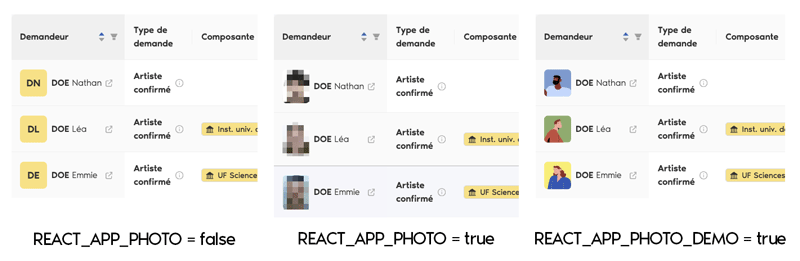

# Configuration de l'environnement d'exécution de l'application

Certaines variables de configuration sont spécifiques à chaque environnement d'exécution de l'application (
développement, staging, production). Par exemple, l'URL de l'API peut varier selon l'environnement déployé.

Pour éviter de reconstruire l'image pour chaque environnement, il est possible de définir des variables d'environnement
qui seront injectées dynamiquement dans l'application au moment de son exécution.

La gestion de ces variables d'environnement repose sur un script shell (`docker-entrypoint.sh`) qui génère
automatiquement
un fichier JavaScript `env.{timestamp}.js` au démarrage du conteneur. Ce fichier contient toutes les variables
d'environnement
dont le nom commence par `REACT_APP_` et les expose via l'objet global `window.env`.

Le timestamp dans le nom du fichier garantit que le navigateur charge toujours la version la plus récente des variables
lors du redémarrage du conteneur, évitant ainsi les problèmes de cache.

> **Remarque :** Vous pouvez déplacer les variables d'environnement entre les fichiers `.env` et les variables
> d'environnement
> du conteneur en fonction des besoins et de la portée souhaitée de chaque variable.

> **Remarque :** Les variables injectées au runtime sont prioritaires sur celles définies dans le fichier `.env`.

> **Note :** Si l'application n'est pas déployée sur plusieurs environnements ou si l'image est reconstruite pour chaque
> environnement, il est possible de définir les variables suivantes directement dans le fichier `.env`.

## Variables liées à l'environnement d'exécution

| **Variable**                | **Description**                                      | **Exemple**                                         | **Obligatoire** |
|-----------------------------|------------------------------------------------------|-----------------------------------------------------|-----------------|
| `REACT_APP_ENVIRONMENT`     | Environnement d'exécution de l'application           | production                                          | Oui             |
| `REACT_APP_API`             | URL de l'API de l'application (backend)              | https://api.esup-portail.org                        | Oui             |
| `REACT_APP_API_PREFIX`      | Prefixe du backend                                   | /api                                                | Non             |
| `REACT_APP_FRONTEND`        | URL de l'application (frontend)                      | https://oasis.esup-portail.org                      | Oui             |
| `REACT_APP_OAUTH_CLIENT_ID` | Identifiant du client OAuth                          | oasis                                               | Oui             |
| `REACT_APP_OAUTH_PROVIDER`  | URL du fournisseur OAuth                             | https://cas.esup-portail.org/cas/oauth2.0/authorize | Oui             |
| `REACT_APP_PHOTO`  ¬        | Afficher les photos des étudiants dans l'application | true                                                | Non             |
| `REACT_APP_PHOTO_DEMO`      | Remplacer les photos par un avatar                   | false                                               | Non             |
| `REACT_APP_DARKMODE`        | Activer le dark mode pour les utilisateurs *         | false                                               | Non             |
| `REACT_APP_GERER_DEMANDES`  | Activer la gestion des demandes dans l'application   | true                                                | Non             |

> **\* REACT_APP_DARKMODE :** en version beta, le dark-mode est désactivé par défaut, mais peut être activé en modifiant
> la variable
> d'environnement `REACT_APP_DARKMODE` à `true`.
> L'activation du mode Contraste (menu Accessibilité) désactive automatiquement le dark-mode.
> Les préférences de mode, comme celles d'accessibilité, sont stockées en backend pour être récupérées lors de la
> connexion de l'utilisateur.

## Focus sur la gestion des demandes

La variable `REACT_APP_GERER_DEMANDES` permet de désactiver entièrement le module de gestion des demandes pour les
établissements qui n'en ont pas l'usage. Lorsqu'elle est définie à `false` :

- Les entrées de menu **Demandes** et **Demandeurs** sont masquées pour tous les profils.
- Pour les **administrateurs**, les référentiels liés aux demandes sont également masqués (types de demandes, campagnes,
  etc.).

> **Par défaut**, la gestion des demandes est activée (`true`). Il n'est pas nécessaire de définir cette variable si le
> module est utilisé.

## Focus sur l'affichage des photos des étudiants

3 modes d'affichage sont disponibles :

L'affichage des photos des étudiants nécessite une configuration spécifique au niveau du backend. Par défaut, les photos
ne sont pas affichées, mais cette option peut être activée en ajustant les variables `REACT_APP_PHOTO` et
`REACT_APP_PHOTO_DEMO` :

- `REACT_APP_PHOTO` : active l'affichage des photos des étudiants.
- `REACT_APP_PHOTO_DEMO` : remplace les photos par des avatars, utile en développement ou en mode démonstration pour
  préserver la confidentialité.

### Spécificités liées aux environnements

| **Valeur de `REACT_APP_ENVIRONMENT`** | **Environnement**   | **Spécificités**                                                                                                                                                        |
|---------------------------------------|---------------------|-------------------------------------------------------------------------------------------------------------------------------------------------------------------------|
| `local`                               | Développement local | - Les photos des utilisateurs ne sont pas affichées. - Le fournisseur `AuthContext` expose le token de l'utilisateur. - Affichage d'un ruban "DEV" sur le logo. |
| `production`                          | Production          | - Il n'est pas possible de prendre l'identité d'un autre utilisateur.                                                                                                   |
| Autres valeurs                        | -                   | - Affichage d'un ruban "TEST" sur le logo.                                                                                                                              |
