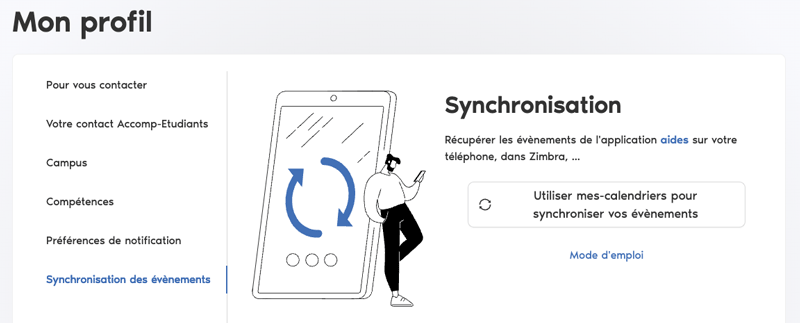

# Configuration technique

La configuration de l'application repose sur les variables d'environnement définies dans le fichier `.env` à la racine
du projet. Un fichier `.env.example` est fourni pour servir de base à la configuration.

> **Note :** Toute modification des variables d'environnement nécessite un nouveau build de l'application pour être
> prise en compte.

## Variables liées à l'établissement et au service d'accompagnement des étudiants

| **Variable**                          | **Description**                                               | **Exemple**                                 | **Obligatoire** |
|---------------------------------------|---------------------------------------------------------------|---------------------------------------------|-----------------|
| `REACT_APP_TITRE`                     | Titre de l'application                                        | Oasis                                       | Oui             |
| `REACT_APP_ETABLISSEMENT`             | Nom de l'établissement                                        | université ESUP                             | Oui             |
| `REACT_APP_ETABLISSEMENT_ARTICLE`     | Nom de l'établissement avec article                           | l'université ESUP                           | Oui             |
| `REACT_APP_ETABLISSEMENT_ABV`         | Abréviation du nom de l'établissement                         | ESUP                                        | Oui             |
| `REACT_APP_ETABLISSEMENT_ABV_ARTICLE` | Abréviation du nom de l'établissement avec article            | l'ESUP                                      | Oui             |
| `REACT_APP_ETABLISSEMENT_URL`         | URL de l'établissement                                        | https://www.esup-portail.org                | Non             |
| `REACT_APP_SERVICE`                   | Service d'accompagnement des étudiants                        | Accomp-Etudiants                            | Oui             |
| `REACT_APP_EMAIL_SERVICE`             | Email du service d'accompagnement des étudiants               | accomp-etudiants@esup-portail.org           | Oui             |
| `REACT_APP_URL_SERVICE`               | URL du service d'accompagnement des étudiants                 | https://accomp-etudiants.esup-portail.org   | Non             |
| `REACT_APP_ESPACE_SANTE`              | Nom du service de santé des étudiants                         | Espace Santé Étudiants                      | Non             |
| `REACT_APP_ESPACE_SANTE_ABV`          | Abréviation du nom du service de santé des étudiants          | ESE                                         | Non             |
| `REACT_APP_ADRESSE_DPD`               | Adresse postale du Délégué à la Protection des données (HTML) | 1 rue de la données\ 33000 BORDEAUX    | Non             |
| `REACT_APP_EMAIL_DPD`                 | Email du Délégué à la Protection des Données                  | dpo@esup-portail.org                        | Non             |
| `REACT_APP_INFOS_AUTH`                | URL d'aide à la connexion au SI de l'établissement            | https://identite-numerique.esup-portail.org | Non             |
| `REACT_APP_LOGO`                      | Logo de l'établissement (URL)                                 | /images/logo.svg                            | Non             |

Pour la personnalisation du logo de l'établissement : se reporter à
la [section dédiée](personnalisation-ui.md#logo-de-létablissement).

## Variables pour le service de synchronisation des événements

Le service de synchronisation des évènements permet, par exemple, de centraliser l'emploi du temps et les rendez-vous
des étudiants. Ce service me fait pas partie du périmètre de l'application.

| **Variable**                      | **Description**                                                                    | **Exemple**                             | **Obligatoire** |
|-----------------------------------|------------------------------------------------------------------------------------|-----------------------------------------|-----------------|
| `REACT_APP_NOM_SERVICE_SYNCHRO`   | Nom du service de synchronisation des évènements                                   | MesCalendriers                          | Non             |
| `REACT_APP_URL_SERVICE_SYNCHRO`   | URL du service de synchronisation des évènements                                   | https://mescalendriers.esup-portail.org | Non             |
| `REACT_APP_GUIDE_SERVICE_SYNCHRO` | URL (relative) du guide d'utilisation du service de synchronisation des évènements | /pdf/mes-calendriers-guide.pdf          | Non             |

Cette configuration est optionnelle, par défaut le service de synchronisation des évènements n'est pas affiché.
Si elle est renseignée, une nouvelle section est affichée dans le menu "Mon compte" :

## Autres variables d'environnement disponibles

| **Variable**              | **Description**                                                                   | **Exemple**           | **Obligatoire** |
|---------------------------|-----------------------------------------------------------------------------------|-----------------------|-----------------|
| `REACT_APP_VISITE_GUIDEE` | Détermine si la visite guidée est affichée sur les écrans de gestion des demandes | false                 | Non             |
| `REACT_APP_VERSION`       | Version de l'application                                                          | 2.1.0                 | Oui             |
| `REACT_APP_MSG_ACCUEIL`   | Message d'accueil affiché sur la page d'accueil                                   | Université ESUP;oasis | Non             |

- `REACT_APP_VISITE_GUIDEE` : à destination des membres de commission, une aide contextuelle présente l'interface et les
  fonctionnalités. Par défaut, la visite guidée est affichée.

- `REACT_APP_MSG_ACCUEIL` : message affiché sur la page d'accueil. Il est présenté avec un effet de typing et peut être
  composé de plusieurs messages séparés par un point-virgule. Par défaut, le message est `REACT_APP_ETABLISSEMENT` puis
  `REACT_APP_TITRE`.