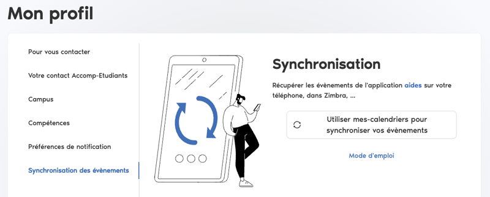

# Configuration technique

La configuration de l'application repose sur les variables d'environnement définies dans le fichier `.env` à la racine
du projet. Un fichier `.env.example` est fourni pour servir de base à la configuration.

> **Note :** Toute modification des variables d'environnement nécessite un nouveau build de l'application pour être
> prise en compte.

## Variables liées à l'établissement et au service d'accompagnement des étudiants

| **Variable**                            | **Description**                                                       | **Exemple**                                            | **Obligatoire** |
|-----------------------------------------|-----------------------------------------------------------------------|--------------------------------------------------------|-----------------|
| `REACT_APP_TITRE`                       | Titre de l'application                                                | Oasis                                                  | Oui             |
| `REACT_APP_ETABLISSEMENT`               | Nom de l'établissement                                                | université ESUP                                        | Oui             |
| `REACT_APP_ETABLISSEMENT_ARTICLE`       | Nom de l'établissement avec article                                   | l'université ESUP                                      | Oui             |
| `REACT_APP_ETABLISSEMENT_ABV`           | Abréviation du nom de l'établissement                                 | ESUP                                                   | Oui             |
| `REACT_APP_ETABLISSEMENT_ABV_ARTICLE`   | Abréviation du nom de l'établissement avec article                    | l'ESUP                                                 | Oui             |
| `REACT_APP_ETABLISSEMENT_URL`           | URL de l'établissement                                                | https://www.esup-portail.org                           | Non             |
| `REACT_APP_SERVICE`                     | Sigle / nom court du service d'accompagnement des étudiants           | TANDEM                                                 | Oui             |
| `REACT_APP_SERVICE_DENOMINATION`        | Dénomination du service affichée dans une phrase (cf. ci-dessous)     | Cellule Boussole                                       | Non             |
| `REACT_APP_SERVICE_ARTICLE`             | Article défini de la dénomination : `le`, `la` ou `l'`                | la                                                     | Non             |
| `REACT_APP_SERVICE_DENOMINATION_LONGUE` | Dénomination développée, 1ʳᵉ mention de la page RGPD (cf. ci-dessous) | Service Tandem d'Accompagnement des Étudiants (TANDEM) | Non             |
| `REACT_APP_EMAIL_SERVICE`               | Email du service d'accompagnement des étudiants                       | accomp-etudiants@esup-portail.org                      | Oui             |
| `REACT_APP_URL_SERVICE`                 | URL du service d'accompagnement des étudiants                         | https://accomp-etudiants.esup-portail.org              | Non             |
| `REACT_APP_ESPACE_SANTE`                | Nom du service de santé des étudiants                                 | Espace Santé Étudiants                                 | Non             |
| `REACT_APP_ESPACE_SANTE_ABV`            | Abréviation du nom du service de santé des étudiants                  | ESE                                                    | Non             |
| `REACT_APP_ADRESSE_DPD`                 | Adresse postale du Délégué à la Protection des données (HTML)         | 1 rue de la données\ 33000 BORDEAUX               | Non             |
| `REACT_APP_EMAIL_DPD`                   | Email du Délégué à la Protection des Données                          | dpo@esup-portail.org                                   | Non             |
| `REACT_APP_INFOS_AUTH`                  | URL d'aide à la connexion au SI de l'établissement                    | https://identite-numerique.esup-portail.org            | Non             |
| `REACT_APP_LOGO`                        | Logo de l'établissement (URL)                                         | /images/logo.svg                                       | Non             |
| `REACT_APP_LOGO_DARK`                   | Logo de l'établissement (URL) pour le mode dark                       | /images/logo-dark.svg                                  | Non             |

Pour la personnalisation du logo de l'établissement : se reporter à
la [section dédiée](personnalisation-ui.md#logo-de-létablissement).

### Dénomination de l'établissement

Comme pour le service (cf. ci-dessous), l'application dérive automatiquement les formes contractées
(« de »/« du »/« de la »/« de l' », « à »/« au »/« à la »/« à l' ») du nom de l'établissement et de
son abréviation, à partir de l'article renseigné dans `REACT_APP_ETABLISSEMENT_ARTICLE` et
`REACT_APP_ETABLISSEMENT_ABV_ARTICLE`.

> **Rétrocompatibilité :** seuls les 2 premiers caractères de ces deux variables sont examinés pour
> déterminer l'article (`le`, `la` ou `l'`). Il est donc possible d'y indiquer soit l'article seul,
> soit — comme dans les exemples ci-dessus (`l'université ESUP`, `l'ESUP`) — le nom ou l'abréviation
> précédé de son article : les instances déjà configurées avec cette dernière convention continuent
> de fonctionner sans modification.

### Dénomination du service

Chaque établissement rattache l'application à une structure interne dont le nom varie fortement (« service TANDEM », «
Cellule Boussole », « ESCALE »…). Pour que toutes les phrases de
l'interface restent grammaticalement correctes (genre, article élidé ou défini, prépositions
contractées, majuscule en début de phrase), 3 variables décrivent cette dénomination (les exemples ci-dessous emploient
un nom de service fictif) :

- `REACT_APP_SERVICE` : le **sigle / nom court**, employé seul dans les intitulés composés (« Accompagnement TANDEM », «
  Renfort TANDEM », « Suivi TANDEM »).
- `REACT_APP_SERVICE_DENOMINATION` : le **groupe nominal complet**, tel qu'il doit apparaître au
  milieu d'une phrase, **sans article** (« service TANDEM », « Cellule Boussole », « ESCALE »).
- `REACT_APP_SERVICE_ARTICLE` : l' **article défini** associé, parmi `le`, `la` ou `l'`.
- `REACT_APP_SERVICE_DENOMINATION_LONGUE` *(optionnelle)* : la **dénomination développée**, employée
  aux points où le service est présenté pour la première fois (titre « responsable de traitement »
  de la page RGPD, encart d'introduction de la page « Demandes »). Y indiquer le nom complet, suivi
  du sigle entre parenthèses. Par défaut, elle vaut `REACT_APP_SERVICE_DENOMINATION`.

À partir de l'article, l'application dérive automatiquement les formes contractées :

| `REACT_APP_SERVICE_ARTICLE` | Forme définie       | Préposition « de »         | Préposition « à »         |
|-----------------------------|---------------------|----------------------------|---------------------------|
| `le` (défaut)               | le service TANDEM   | **du** service TANDEM      | **au** service TANDEM     |
| `la`                        | la Cellule Boussole | **de la** Cellule Boussole | **à la** Cellule Boussole |
| `l'`                        | l'ESCALE            | **de l'**ESCALE            | **à l'**ESCALE            |

Avec `l'`, aucun espace n'est ajouté après l'apostrophe (« l'ESCALE », « de l'ESCALE »). La majuscule
initiale des phrases (« **La** Cellule Boussole de l'université ESUP est responsable du
traitement… ») est ajoutée par l'application ; il ne faut donc pas la mettre dans
`REACT_APP_SERVICE_DENOMINATION`.

> **Rétrocompatibilité :** si `REACT_APP_SERVICE_DENOMINATION` n'est pas renseignée, l'application
> utilise `service <REACT_APP_SERVICE>` avec l'article `le`. Les instances déjà déployées qui ne
> définissent que `REACT_APP_SERVICE` continuent d'afficher les mêmes textes qu'auparavant, sans
> reconfiguration.

## Variables pour le service de synchronisation des événements

Le service de synchronisation des évènements permet, par exemple, de centraliser l'emploi du temps et les rendez-vous
des étudiants. Ce service me fait pas partie du périmètre de l'application.

| **Variable**                      | **Description**                                                                    | **Exemple**                             | **Obligatoire** |
|-----------------------------------|------------------------------------------------------------------------------------|-----------------------------------------|-----------------|
| `REACT_APP_NOM_SERVICE_SYNCHRO`   | Nom du service de synchronisation des évènements                                   | MesCalendriers                          | Non             |
| `REACT_APP_URL_SERVICE_SYNCHRO`   | URL du service de synchronisation des évènements                                   | https://mescalendriers.esup-portail.org | Non             |
| `REACT_APP_GUIDE_SERVICE_SYNCHRO` | URL (relative) du guide d'utilisation du service de synchronisation des évènements | /pdf/mes-calendriers-guide.pdf          | Non             |

Cette configuration est optionnelle, par défaut le service de synchronisation des évènements n'est pas affiché.
Si elle est renseignée, une nouvelle section est affichée dans le menu "Mon compte" :

## Autres variables d'environnement disponibles

| **Variable**              | **Description**                                                                   | **Exemple**           | **Obligatoire** |
|---------------------------|-----------------------------------------------------------------------------------|-----------------------|-----------------|
| `REACT_APP_VISITE_GUIDEE` | Détermine si la visite guidée est affichée sur les écrans de gestion des demandes | false                 | Non             |
| `REACT_APP_MSG_ACCUEIL`   | Message d'accueil affiché sur la page d'accueil                                   | Université ESUP;oasis | Non             |

- `REACT_APP_VISITE_GUIDEE` : à destination des membres de commission, une aide contextuelle présente l'interface et les
  fonctionnalités. Par défaut, la visite guidée est affichée.

- `REACT_APP_MSG_ACCUEIL` : message affiché sur la page d'accueil. Il est présenté avec un effet de typing et peut être
  composé de plusieurs messages séparés par un point-virgule. Par défaut, le message est `REACT_APP_ETABLISSEMENT` puis
  `REACT_APP_TITRE`.