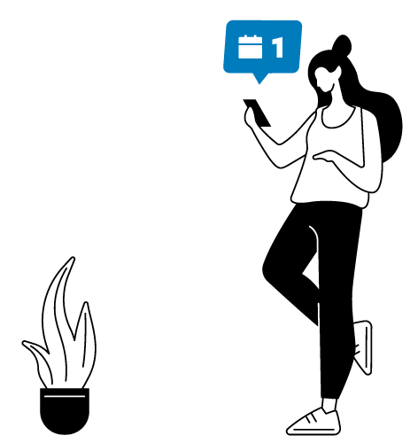
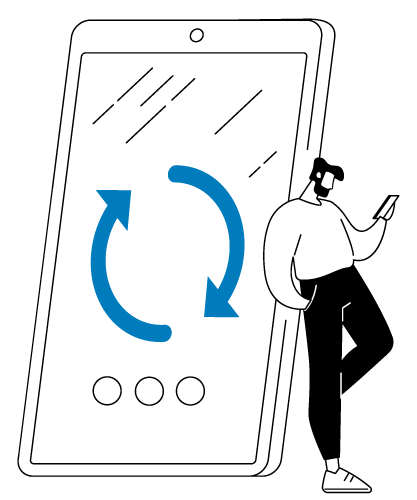

# Personnalisation UI

La personnalisation de l'application repose sur les variables d'environnement définies dans le fichier .env à la racine
du projet.

L'application utilise par défaut la police **NoirPro**. Pour la personnalisation des illustrations, cette police est
incluse dans le dossier `ressources/fonts`.

## Logo de l'établissement

Pour la personnalisation du logo de l'établissement, il est recommandé d'utiliser le format SVG pour une meilleure
qualité d'affichage. Le fichier doit être placé dans le dossier `public/images`. L'URL à renseigner dans la variable
`REACT_APP_LOGO` du fichier `.env` est alors du type `/images/fichier-logo.svg`.

Ce logo est uniquement affiché sur la page de connexion de l'application et sur la page d'information sur l'utilisation
des données personnelles (`/rgpd`).

Il est possible de ne pas afficher le logo en laissant la variable `REACT_APP_LOGO` vide.

> Le logo utilisé dans les exportations PDF est à paramétrer dans la partie backend de l'application.

## Favicon

La favicon de l'application est à personnaliser en remplaçant le fichier `public/favicon.ico`. Il est recommandé
d'utiliser un fichier au format `.ico` et l'icône doit être de taille 16x16 ou 32x32 pixels pour une meilleure
compatibilité.

## apple-touch-icon

Pour les appareils Apple, il est recommandé de personnaliser l'icône affichée sur l'écran d'accueil. Pour cela, il faut
remplacer le fichier `public/apple-touch-icon.png`. Il est recommandé d'utiliser un fichier au format `.png` et l'icône
doit être de taille 192x192 pixels.

## Icônes de l'application en mode PWA

Pour les appareils mobiles, il est recommandé de personnaliser les icônes de l'application en mode PWA (Progressive Web
App). Ces icônes sont déclarées dans le fichier `public/manifest.json`.

Les icônes sont stockées dans le dossier `public/images/icons`. Il est recommandé d'utiliser des fichiers au format
`.png` et les icônes doivent être de taille 192x192 et 512x512 pixels pour chaque situation (maskable et non maskable).
La version "maskable" est utilisée pour les appareils Android.

Les fichiers SVG fournis dans ce répertoire et le fichier `ressources/application-icon.ai` peuvent être utilisés pour
générer les icônes aux formats requis.

## Couleurs

Les couleurs doivent être personnaliséés dans le fichier `.env` à la racine du projet. Les variables suivantes sont
disponibles :

| **Variable**                         | **Description**                                       | **Exemple** | **Obligatoire** |
|--------------------------------------|-------------------------------------------------------|-------------|-----------------|
| `REACT_APP_PRIMARY_COLOR`            | Couleur principale de l'application                   | #1d71b8     | Oui             |
| `REACT_APP_PRIMARY_CONTRAST_COLOR`   | Couleur principale de l'application en mode contrasté | #000000     | Non             |
| `REACT_APP_PRIMARY_LIGHT_COLOR`      | Couleur principale de l'application (light)           | #e1f5ff     | Non             |
| `REACT_APP_SECONDARY_COLOR`          | Couleur secondaire de l'application                   | #ffe082     | Non             |
| `REACT_APP_SECONDARY_LIGHT_COLOR`    | Couleur secondaire de l'application (light)           | #fff8e1     | Non             |
| `REACT_APP_SECONDARY_CONTRAST_COLOR` | Couleur secondaire de l'application en mode contrasté | #e1e1e1     | Non             |
| `REACT_APP_ERROR_COLOR`              | Couleur d'erreur                                      | #ff4d4f     | Non             |
| `REACT_APP_ERROR_LIGHT_COLOR`        | Couleur d'erreur (light)                              | #fff0f0     | Non             |
| `REACT_APP_WARNING_COLOR`            | Couleur d'avertissement                               | #EF7D03     | Non             |
| `REACT_APP_WARNING_LIGHT_COLOR`      | Couleur d'avertissement (light)                       | #fff4e8     | Non             |
| `REACT_APP_SUCCESS_COLOR`            | Couleur de succès                                     | #52c41a     | Non             |
| `REACT_APP_SUCCESS_LIGHT_COLOR`      | Couleur de succès (light)                             | #b0f091     | Non             |

Seule la variable `REACT_APP_PRIMARY_COLOR` est obligatoire. Les autres variables sont optionnelles. Si elles ne sont
pas renseignées, des valeurs sont calculées automatiquement à partir de la couleur principale ou fixées par défaut.

> **Note :** La couleur primaire choisie doit être suffisamment contrastée pour garantir une bonne lisibilité avec des textes en
> blanc (#FFFFFF). Il est recommandé de vérifier la conformité de la couleur choisie avec des outils de vérification
> de contraste tels que [Contrast Checker](https://contrastchecker.com/).

## Images d'illustration

### Page d'accueil


L'image de la page d'accueil s'adapte avec la couleur principale de l'application (`REACT_APP_PRIMARY_COLOR`).
Si vous souhaitez modifier l'image, la source est disponible dans le dossier `ressources/homepage.svg`. Les
modifications
sont à apporter dans le fichier `src/controls/Images/HomepageImage.tsx`.

### Tableau de bord intervenant


L'image du dashboard des intervenants s'adapte avec la couleur principale de l'application (`REACT_APP_PRIMARY_COLOR`).
Si vous souhaitez modifier l'image, la source est disponible dans le dossier `ressources/etudiant-dashboard.svg`. Les
modifications sont à apporter dans le fichier `src/controls/Images/EtudiantDashboardImage.tsx`.

### Mon compte > Préférences de notification



L'image d'illustration dans l'écran Mon compte > Préférences de notification s'adapte avec la couleur principale de l'
application (`REACT_APP_PRIMARY_COLOR`).
Si vous souhaitez modifier l'image, la source est disponible dans le dossier `ressources/etudiant-notification.svg`. Les
modifications sont à apporter dans le fichier `src/controls/Images/EtudiantNotificationImage.tsx`.

### Mon compte > Synchronisation des évènements



L'image d'illustration dans l'écran Mon compte > Synchronisation des évènements s'adapte avec la couleur principale de
l'application (`REACT_APP_PRIMARY_COLOR`).
Si vous souhaitez modifier l'image, la source est disponible dans le dossier `ressources/etudiant-sync-evt.svg`. Les
modifications sont à apporter dans le fichier `src/controls/Images/EtudiantSyncEvtImage.tsx`.

### Détails d'un évènement (étudiant)


L'image d'illustration dans la modale de détail des évènements s'adapte avec la couleur principale de l'application (
`REACT_APP_PRIMARY_COLOR`).
Si vous souhaitez modifier l'image, la source est disponible dans le dossier `ressources/etudiant-classroom.svg`. Les
modifications sont à apporter dans le fichier `src/controls/Images/EtudiantClassroomImage.tsx`.

### Ajouter une intervention (renfort)


L'image d'illustration de la création d'une intervention personnelle par un renfort s'adapte avec la couleur principale
de l'application (`REACT_APP_PRIMARY_COLOR`).
Si vous souhaitez modifier l'image, la source est disponible dans le dossier `ressources/renfort-intervention-add.svg`.
Les
modifications sont à apporter dans le fichier `src/controls/Images/RenfortInterventionAddImage.tsx`.

## Mentions légales

Les mentions légales sont à personnaliser dans le fichier `src/routes/commun/MentionsLegales.tsx` :

```
{/* ------ INSEREZ ICI VOTRE TEXTE DE MENTIONS LEGALES ------ */}
```

Elles sont affichées dans le pied de page de la page d'authentification.

## Politique d'utilisation des données

Les informations relatives à la politique d'utilisation des données sont générées dynamiquement à partir des
informations configurées
dans le fichier `.env`. Pour les personnaliser, il est nécessaire de modifier directement le fichier
`src/routes/commun/Rgpd.tsx`.

Elles sont affichées dans le pied de page de l'application.